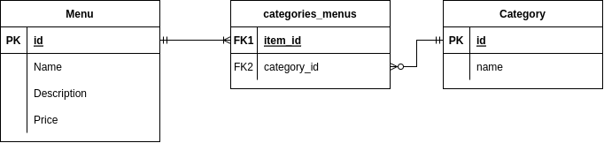

# Gigih Family Catering
## Description
This is a Final Project Assignment repository for Generasi Gigih 2.0 Back-end Track. This project is a full-stack web app that manage catering management system using RoR 7. This project isn't fully completed.

# ERD


# Project spec
* Rails 7.0.2.3
* Ruby 3 (3.0.3p157 (2021-11-24 revision 3fb7d2cadc) [x86_64-linux])


## Getting Started
### Steps to run this locally or on Replit
```bash
# install the required libraries and depenencies
$ bundle install

# run the database migrations
$ rails db:migrate

# populate some tables from the seeder
$ rails db:seed

# start the local server
$ rails s
```